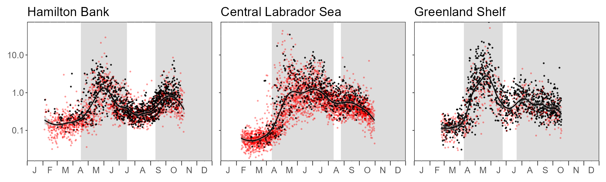

<!-- The following code should appear at the beginning of the first appendix.
(if you have one)
After that, all subsequent sections will be turned into appendices. -->

`r if(knitr:::is_latex_output()) '% begin csasdown appendix'`
`r if(!knitr:::is_latex_output()) '# (APPENDIX) Appendix {-}'`

\clearpage

# Ocean Color Polygon Seasons {#app:first-appendix}

(ref:AZOMPseasonbounds) Time series of daily average concentrations within each Labrador Sea polygon over the climatological period (2003-2020). Grey shaded areas indicate the spring and fall bloom periods. White areas indicate the winter and summer periods. Red circles corresponds to daily data coverage of less than 20% of a polygon. Days of the year marking the transition from winter to spring, spring to summer, and summer to fall are 107, 197, and 254 (Hamilton Bank), 102, 223, and 238 (Central Labrador Sea), and 99, 175, and 203 (Greenland Shelf).  

```{r imgbefaft, fig.pos="H", fig.cap = "(ref:AZOMPseasonbounds)"}

```


<!-- At the end of your appendices add: -->
`r if(knitr:::is_latex_output()) '% end csasdown appendix'`
