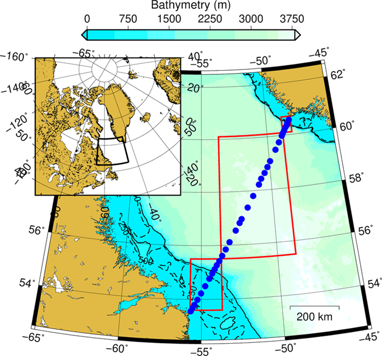

\clearpage

# Figures

(ref:AR7Wmap) AR7W transect within the Labrador Sea. Blue dots represent the location of the core stations. Red boxes correspond to the regions where satellite chl-a concentration is extracted (i.e., Hamilton Bank, Central Labrador Sea, and Greenland Shelf). Solid and dashed black lines correspond to the 500 and 250 m isobaths, respectively.  

```{r AR7Wmap, fig.pos="H", fig.cap = "(ref:AR7Wmap)"}

```


(ref:cruisebloomdates) Blue rectangles represent the sampling period (actual occupation of AR7W line) and green rectangles correspond to the duration of the spring bloom within each region as derived from satellite ocean colour. Dates are reported in day of year. The COVID pandemic prevented the execution of the mission in 2020. Vessel availability lead to the absence of a mission in 2017. Mission in 2019 and 2020 onboard CCGS Amundsen respectively in late-June and August. Vertical red line represents our cutoff date separating spring and summer (day of year 170).   

```{r cruisebloomdates, fig.pos="H", fig.cap = "(ref:cruisebloomdates)"}
knitr::include_graphics("figures/Cruise_Bloom_dates.png")
```


(ref:TICpH) Time series of total inorganic carbon (blue solid circles) and pH (red solid circles) within the Newly-Ventilated Labrador Sea Water defined as 150–500 m in the Central Labrador Sea. Vertical bars indicate one standard deviation and black solid lines correspond to the linear regression of TIC and pH against time in year for stations located in the CLS for the period 1996–2023.   

```{r TICpH, fig.pos="H", fig.cap = "(ref:TICpH)"}
knitr::include_graphics("figures/TIC_pH.png")
```


(ref:CFC12SF6) Annual mean concentrations of CFC-12 (blue solid triangles) and $SF_6$ (red solid triangles) in Newly-Ventilated Labrador Sea Water defined as 150–500 m in the Central Labrador Sea from 1991 to 2023. Vertical bars indicate one standard deviation.  

```{r CFC12SF6, fig.pos="H", fig.cap = "(ref:CFC12SF6)"}
knitr::include_graphics("figures/CFC12_SF6.png")
```


(ref:scorecardtemperature) Scorecards for average temperature measured from downcast CTD from surface to 100 m from 1997 to 2023 for the HB, CLS, and GS polygons. Grey boxes indicate no data or late sampling years (not included in the reference period average). Numbers in the scorecards’ cells represent the annual standardized anomalies. Numbers on the right side indicate the mean values 1999–2020 (i.e., reference) for a given region as well as the standard deviation (i.e., mean ± standard deviation).   

```{r scorecardtemperature, fig.pos="H", fig.cap = "(ref:scorecardtemperature)"}
knitr::include_graphics("figures/Scorecard_LabSea_time_series_Temperature_1997-2023_ref1999-2020.png")
```


(ref:scorecardnutrientsshallow) Scorecards for surface nutrients from 1997 to 2023 for the HB, CLS, and GS polygons. Grey boxes indicate no data or late sampling years (not included in the reference period average). Numbers in the scorecards’ cells represent the annual standardized anomalies. Numbers on the right side indicate the mean values 1999–2020 (i.e., reference) for a given region as well as the standard deviation (i.e., mean ± standard deviation).   

```{r scorecardnutrientsshallow, fig.pos="H", fig.cap = "(ref:scorecardnutrientsshallow)"}
knitr::include_graphics("figures/Scorecard_LabSea_time_series_NutrientsShallow_1997-2023_ref1999-2020.png")
```


(ref:scorecardnutrientsdeep) Scorecards for deep nutrients from 1997 to 2023 for the HB, CLS, and GS. Grey boxes indicate no data or late sampling years (not included in the reference period average). Numbers in the scorecards’ cells represent the annual standardized anomalies. Numbers on the right side indicate the mean values 1999–2020 (i.e., reference) for a given region as well as the standard deviation (i.e., mean ± standard deviation).   

```{r scorecardnutrientsdeep, fig.pos="H", fig.cap = "(ref:scorecardnutrientsdeep)"}
knitr::include_graphics("figures/Scorecard_LabSea_time_series_NutrientsDeep_1997-2023_ref1999-2020.png")
```


(ref:scorecardchla) Scorecards for in situ chl-a from 1997 to 2023 for the HB, CLS, and GS. Grey boxes indicate no data or late sampling years (not included in the reference period average). Numbers within cells represent the annual standardized anomalies. Numbers on the right side indicate the mean values 1999–2020 (i.e., reference) for a given region as well as the standard deviation (i.e., mean ± standard deviation).   

```{r scorecardchla, fig.pos="H", fig.cap = "(ref:scorecardchla)"}
knitr::include_graphics("figures/Scorecard_LabSea_time_series_Chla_1997-2023_ref1997-2020.png")
```


(ref:scorecardoceancolor) Scorecards for the seasonal chl-a metrics (timing is the day of year, and averages are measured in $mg~m^{-3}$) from 2003 to 2023 for the HB, CLS, and GS polygons. Grey boxes indicate no data. Numbers within cells represent the annual standardized anomalies. Numbers on the right side indicate the mean values 2003–2020 (i.e., reference) for a given region as well as the standard deviation (i.e., mean ± standard deviation).   

```{r scorecardoceancolor, fig.pos="H", fig.cap = "(ref:scorecardoceancolor)"}
knitr::include_graphics("figures/Scorecard_LabSea_time_series_Ocean_Color_2003-2023_ref2003-2020_ForRegionalDoc.png")
```


(ref:scorecardcalanus) Calanus finmarchicus abundances from 1997 to 2023 for HB, CLS, and GS expressed as normalized anomalies (dimensionless) based on 1999–2020 reference period. The bottom panel shows the Population Development Index (PDI) calculated as the sum abundance of copepodite C1-C3 * 100 and divided by the sum of all developmental stages. Numbers on the right side indicate the mean values 1999–2020 (i.e., reference period) for a given region as well as the standard deviation (i.e., mean ± standard deviation). Grey cells indicate anomalies were omitted due to late sampling or that no sampling occurred that year due to lack of vessel (2017, 2021).  


```{r scorecardcalanus, fig.pos="H", fig.cap = "(ref:scorecardcalanus)"}
knitr::include_graphics("figures/Scorecard_LabSea_time_series_CfinPDI_1995-2023_ref1999-2020.png")
```

(ref:scorecardglachyper) Calanus glacialis (top panel) and Calanus hyperboreus (bottom panel) abundances from 1997 to 2023 for HB, CLS, and GS expressed as normalized anomalies (dimensionless) based on 1999–2020 reference period. Numbers on the right side indicate the mean values 1999–2020 (i.e., reference period) for a given region as well as the standard deviation (i.e., mean ± standard deviation). Grey cells indicate anomalies were omitted due to late sampling or that no sampling occurred that year due to lack of vessel (2017, 2021).    

```{r scorecardglachyper, fig.pos="H", fig.cap = "(ref:scorecardglachyper)"}
knitr::include_graphics("figures/Scorecard_LabSea_time_series_CglacChyper_1995-2023_ref1999-2020.png")
```

(ref:scorecardpseudo) Pseudocalanus spp. (top panel) and Oithona spp. (bottom panel) abundances from 1997 to 2023 for HB, CLS, and GS expressed as normalized anomalies (dimensionless) based on 1999–2020 reference period. Numbers on the right side indicate the mean values 1999–2020 (i.e., reference period) for a given region as well as the standard deviation (i.e., mean ± standard deviation). Grey cells indicate anomalies were omitted due to late sampling or that no sampling occurred that year due to lack of vessel (2017, 2021).    

```{r scorecardpseudo, fig.pos="H", fig.cap = "(ref:scorecardpseudo)"}
knitr::include_graphics("figures/Scorecard_LabSea_time_series_PseudoOith_1995-2023_ref1999-2020.png")
```

(ref:scorecardeuph) Euphausiid (top panel) and Amphipoda (bottom panel) abundances from 1997 to 2023 for the HB, CLS, and GS expressed as normalized anomalies (dimensionless) based on 1999–2020 reference period. Numbers on the right side indicate the mean values 1999–2020 (i.e., reference period) for a given region as well as the standard deviation (i.e., mean ± standard deviation). Grey cells indicate anomalies were omitted due to late sampling or that no sampling occurred that year due to lack of vessel (2017, 2021).    

```{r scorecardeuph, fig.pos="H", fig.cap = "(ref:scorecardeuph)"}
knitr::include_graphics("figures/Scorecard_LabSea_time_series_EuphAmph_1995-2023_ref1999-2020.png")
```

