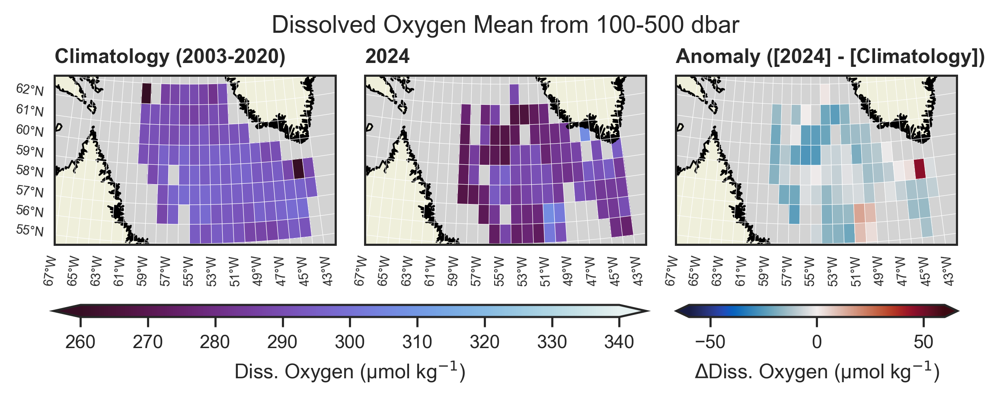
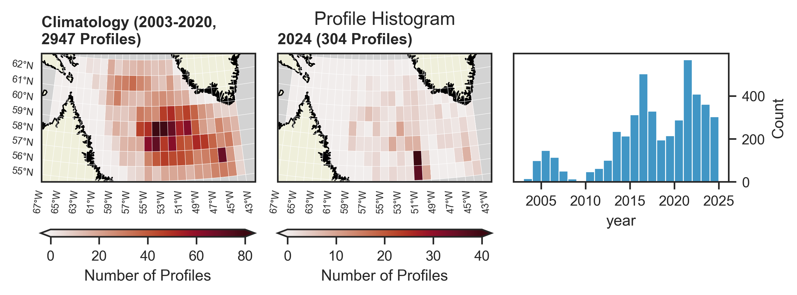
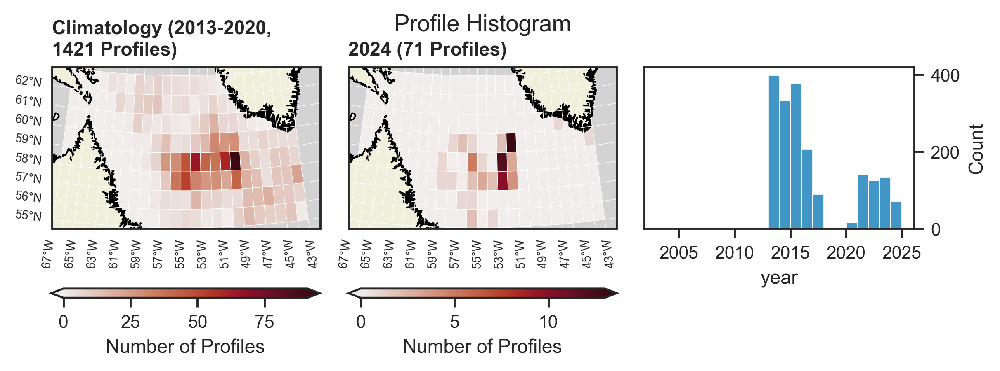
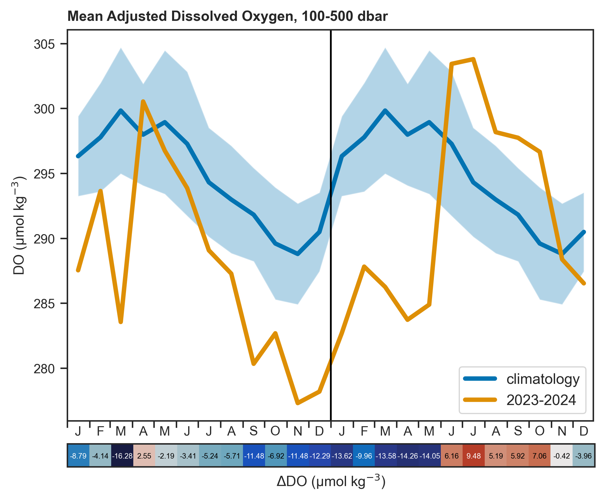
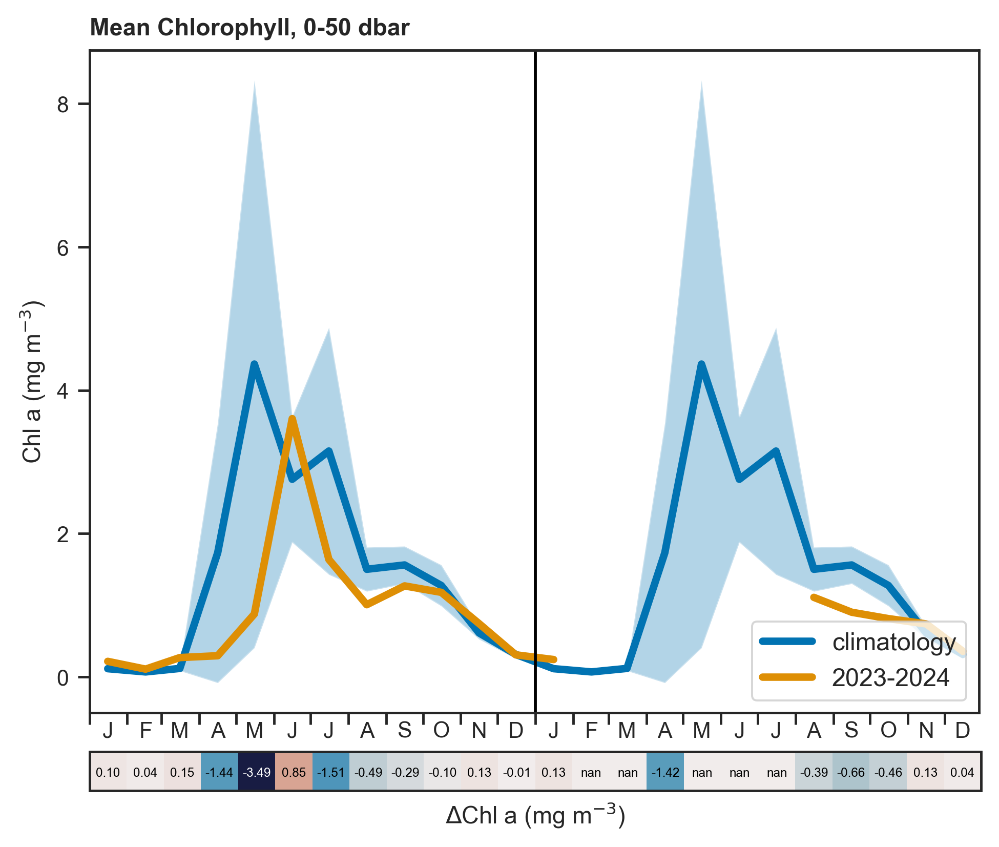
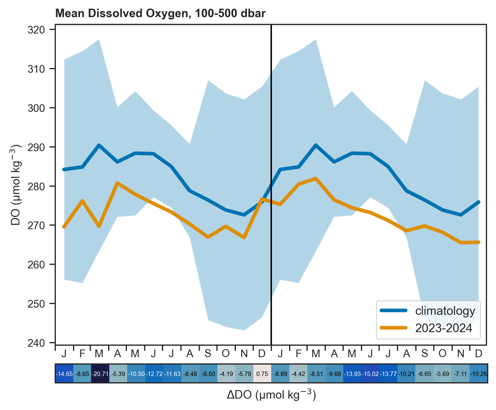

# argoBGC

This directory contains code for analyzing _biogeochemical_ argo data: temperature, salinity (practical salinity measured, absolute salinity derived) and potential density. The mixed layer depth is also computed. 

Data scripts:

- `fetch_process_data.py`: the workhorse script, fetches Argo data over errdap via the python package `argopy`. It then computes the mean values and standard deviations of the desired variables. Creates the data file `data/argo_bgc_means.csv`.

Plotting and analysis scripts:

- `gridded_data.py`: compute climatology in grid cells and plot climatology, analysis year, and anomaly. Also produces histogram and mask plots for each variable.
- `seasonal_climatology.py`: last 2 years of data relative to 2002-2020 climatology.

## Results and Data Volume

The above scripts have been run for all BGC-Argo variables with the exception of irradiance. 

The robustness of the results, however, vary parameter to parameter. Dissolved oxygen (DOXY) is the only parameter that has sufficient data to reasonably compare recent years to the past, and even then I hesitate to formally call the baseline a "climatology". See the histograms below: 

Contrast that with the next most populous parameter, chlorophyll:

Timeseries results should be interpreted with similar caution, but may have more value than the gridded products for the more sparse variables: 

    
    

## Adjusted vs. Unadjusted Variables

BGC-Argo variables ususally require some form of adjustment before being used scientifically. For oxygen, a gain factor is applied to adjust the whole profile by a multiplicative factor (*DOXY_ADJUSTED = DOXY x G*). This gain factor is computed individually for each sensor. For this reason, I have used the DOXY_ADJUSTED field. The effect can be seen in comparing the standard deviation in above plot which uses DOXY_ADJUSTED and the below which uses raw DOXY:

