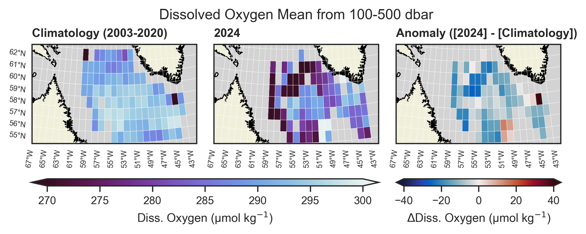

# argoBGC

This directory contains code for analyzing _biogeochemical_ argo data: temperature, salinity (practical salinity measured, absolute salinity derived) and potential density. The mixed layer depth is also computed. 

Data scripts:

- `fetch_process_data.py`: the workhorse script, fetches Argo data over errdap via the python package `argopy`. It then computes the mean values and standard deviations of the desired variables. Creates the data file `data/argo_bgc_means.csv`.

Plotting and analysis scripts:

- `gridded_data.py`: compute climatology in grid cells and plot climatology, analysis year, and anomaly. Also produces histogram and mask plots for each variable.
- `seasonal_climatology.py`: last 2 years of data relative to 2002-2020 climatology.

## Results and Data Volume/Quality

The above scripts have been run for all BGC-Argo variables with the exception of irradiance. The robustness of the results, however, vary parameter to parameter. Dissolved oxygen (DOXY) is the only parameter that has sufficient data to reasonably compare recent years to the past, and even then I hesitate to formally call the baseline a "climatology". 

Due to the lower data volume, I have reduced the requirements to establish a baseline to _N > 10_ samples in each grid cell and _Pmax > 800_. Many older BGC profiles only go down to 1000m, probably due to the higher data volume being transmitted over the slower Argos telemetry system at the time. For this reason I would also be careful interpreting the 1000-2000 dbar depth range figures, as there is reduced data and/or profiles that are contributing that only have measurements down to 1010 dbar for example.

## Adjusted vs. Unadjusted Variables

BGC-Argo variables ususally require some form of adjustment before being used scientifically. For oxygen, a gain factor is applied to adjust the whole profile by a multiplicative factor (*DOXY_ADJUSTED = DOXY x G*). This gain factor is computed individually for each sensor. For this reason, I have used the DOXY_ADJUSTED field. The effect can be seen in comparing the plots below which uses DOXY_ADJUSTED (left) and raw DOXY (right):

    
    

Not all profiles have adjustments, so in using the adjusted field we lose ~500 profiles from the climatology and ~150 profiles from 2024 (can see this comparing `DOXY_histogram_map.png` and `DOXY_ADJUSTED_histogram_map.png`).