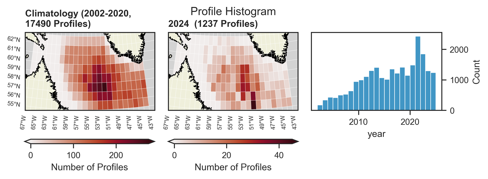

# argoPhysics

This directory contains code for analyzing _physical_ argo data: temperature, salinity (practical salinity measured, absolute salinity derived) and potential density. The mixed layer depth is also computed. 

Data scripts:

-`fetch_process_data.py`: the workhorse script, fetches Argo data over errdap via the python package `argopy`. It then computes the mean values and standard deviations of the desired variables. Creates the data file `data/argo_physical_means.csv`.
- `calculate_anomalies.py`: compute anomalies relative to a defined climatology time period, also adds some metadata variables (ex. profile month for use in seasonal analysis). Creates the data files `data/argo_physical_means_anomalies.csv`.

Plotting and analysis scripts:

- `argo_timeseries.py`: plot timeseries of physical variables, in absolute values and anomalies.
- `gridded_data.py`: compute climatology in grid cells and plot climatology, analysis year, and anomaly. Also produces histogram and mask plots. 
- `plot_argo_mld.py`: mixed layer timeseries and yearday plots
- `seasonal_climatology.py`: last 2 years of data relative to 2002-2020 climatology
- `seasonal_plots.py`: yearday plots for each variable

The matlab scripts `get_mld.m` and `ra_mld.m` are there for reference and served as the basis of the MLD calculation in `fetch_process_data.py` to ensure Zeliang and I computed the mixed layer depth in the same manor.

## Climatology

The climatology is computed by taking the mean of the yearly means from 2002-2020. This ensures that each year is weighted equally in the climatology despite that there are more profiles in more recent years (see third panel of histogram figure below). The lower time limit of the climatology is a result of the earliest profiles available in the Labrador Sea, not a user-set time limit. 

In the gridded climatology, some cells are masked out if (1) maximum pressure of the Argo profiles indicates insufficient depth or (2) there are too few profiles to create a reliable value. The masks are shown in the figure below along with their criteria. 

Finally, an example of the climatology, analysis year, and anomaly is shown here: 

## Timeseries

All timeseries use more restrictive geography than the maps shown above. Any data shown in the timeseries plots falls in the central Labrador Sea, defined in `data/polygon_3300m.csv`.